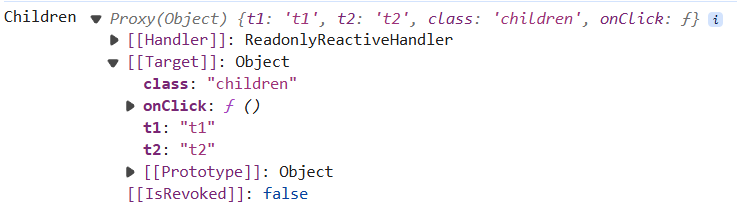
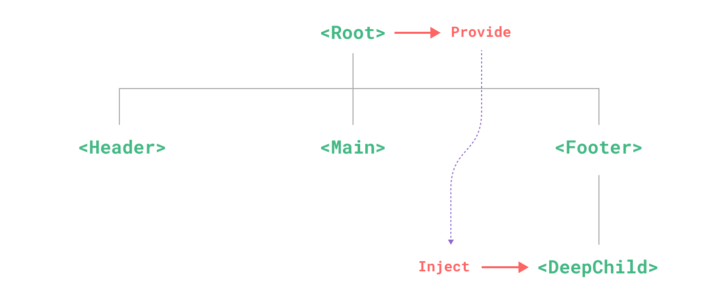

# Vue 组件间通信

## props 传递数据(父 → 子)

父组件将要传递的数据写入子组件的标签属性中，子组件通过 props 来获取父组件传递的数据。

```vue title='Parent.vue'
<template>
  <Children name="jack" :age="18" />
</template>
```

```vue title='Children.vue'
<script>
  export default {
    props: ['name', age],
  };
</script>
```

## $emit 触发自定义事件(子 → 父)

父组件将逻辑函数传递给子组件，子组件接受后触发逻辑函数返回给父子间信息。

```vue title='Parent.vue'
<template>
  <Children @add="addUser" />
</template>
<script>
  export default {
    // ...
    methods: {
      addUser(user) {
        // ...
      },
    },
  };
</script>
```

```vue title='Children.vue'
<template>
  <button @click="addUser">添加用户</button>
</template>
<script>
  export default {
    // ...
    methods: {
      addUser() {
        this.$emit('add', { name: 'wendy', age: 18 });
      },
    },
  };
</script>
```

## $refs 与 $children(子 → 父)

父组件可以通过 `$refs` 与 `$children` 获取到子组件实例，通过实例直接获取子组件的数据信息。

> 可以通过多个 `$refs` 与 `$children` 传递获取到各个后代的数据信息。

```vue title='Parent.vue'
<template>
  <Children ref="children" />
</template>
<script>
  export default {
    // ...
    methods: {
      getChildrenData(key) {
        // this.$children ...
        return this.$refs.children[key];
      },
    },
  };
</script>
```

## $parent 或 $root (父 → 子)

与`$refs`类似 vue 组件可以访问`this.$parent`获取到直接父级实例，访问`this.$root`获取到根节点实例，并通过实例获取到组件信息。

> 由于可以直接拿到父级或根节点实例，那么也可以直接使用其实例的方法事件等，可以结合其他的传送方式达到同级传输信息的效果。但是这样通常会让项目信息传递变得混乱。

```vue
<script>
  export default {
    // ...
    mounted() {
      // 在 mounted 后才可以访问当实例
      // this.$parent...
      // this.$root...
    },
  };
</script>
```

## $attrs 与 $listeners (父 → 子)

这里在讨论 vue3 中的`$attrs`与`$listeners`。vue2 的`$attrs`与`$listeners`可以转至 [vue2 中的$attrs 与$listeners](./)。

> > Vue3 已经不支持 $listeners 了。

在 vue 组件通过`props`传递数据时，子组件可能没有通过`props`接收，这部分没有被`props`接收的组件会保存在子组件的`$attrs`中（style 和 class 也会保存）

```vue title='Parent.vue'
<template>
  <Children t0="t0" t1="t1" t2="t2" class="children" @click="clickCallback"></Children>
</template>
```

```vue title="Children.vue"
<script>
  export default {
    // ...
  	props: ['t0']
    created() {
      console.log("Children", this.$attrs);
    },
  };
</script>
```

输出如图：



如果需要多层传递数据信息，可以使用`v-bind`批量绑定`$attrs`中的属性：

```vue
<template>
  <Children class="children" v-bind="$attrs"></Children>
</template>
```

## provide 与 inject (父 → 孙)

[vue2 provide-inject 介绍](https://v2.cn.vuejs.org/v2/api/#provide-inject) / [vue3 provide-inject 介绍](https://cn.vuejs.org/guide/components/provide-inject)

`provide`与`inject`可以直接绕过目标组件之间的其他组件直接进行数据信息传递：



vue2 中简单的使用：

```vue title="Parent.vue"
<script>
  export default {
    // ...
    provide: {
      name: 'Wendy',
      age: 18,
    },
  };
</script>
```

```vue title="Grandchild.vue"
<script>
  export default {
    // ...
    // inject: ['name', 'age'], 使用数组接收
    inject: {
      userName: {
        from: 'name',
        default: 'noUser',
      },
      userAge: {
        from: 'age',
        default: 18,
      },
    },
  };
</script>
```

## EventBus 事件总线(任意 → 任意)

`EventBus`基于`订阅/发布`模式实现，相当于一个独立于各个组件的事件处理中心。每个组件都可以通过`EventBus`进行信息传递。

在创建好`EventBus`后，组件可以通过`$on`接收指定类型的信息，也可以通过`$emit`发送指定类型的信息。

```js
// 通过 Vue 创建 EventBus
Vue.prototype.$bus = new Vue();
```

发送名为 `eventName` 的事件。

```vue title='Children1.vue'
<script>
  export default {
    // ...
    methods: {
      sendEvent(data) {
        this.$bus.$emit('eventName', data);
      },
    },
  };
</script>
```

接收名为 `eventName` 的事件。

```vue title='Children2.vue'
<script>
  export default {
    // ...
    created() {
      this.$bus.$on('eventName', (data) => {
        // ...
      });
    },
  };
</script>
```

## vuex (任意 → 任意)

[Vuex](https://vuex.vuejs.org/zh/) 是一个专为 Vue.js 应用程序开发的状态管理模式 + 库。它采用集中式存储管理应用的所有组件的状态，并以相应的规则保证状态以一种可预测的方式发生变化。

在 vue 组件中可以通过 watch 监听 vuex 数据的变化并作出相应改变：

```vue
<script>
  export default {
    // ...
    watch: {
      '$store.state.count'(newVal, oldVal) {
        // ...
      },
      '$store.state.message'(newVal, oldVal) {
        // ...
      },
    },
  };
</script>
```

## 参考

1. [组件间通信的方案](https://vue3js.cn/interview/vue/communication.html#%E4%B8%89%E3%80%81%E7%BB%84%E4%BB%B6%E9%97%B4%E9%80%9A%E4%BF%A1%E7%9A%84%E6%96%B9%E6%A1%88)
