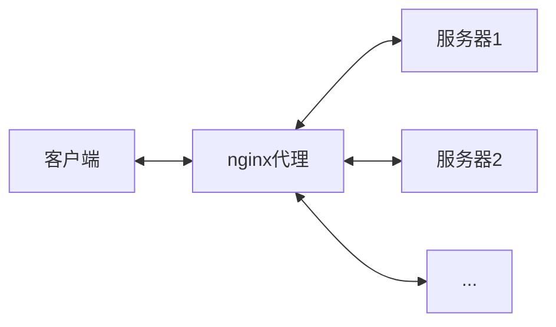
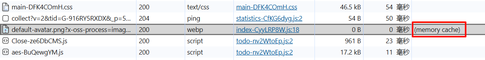
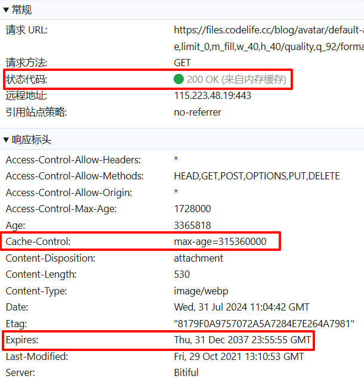
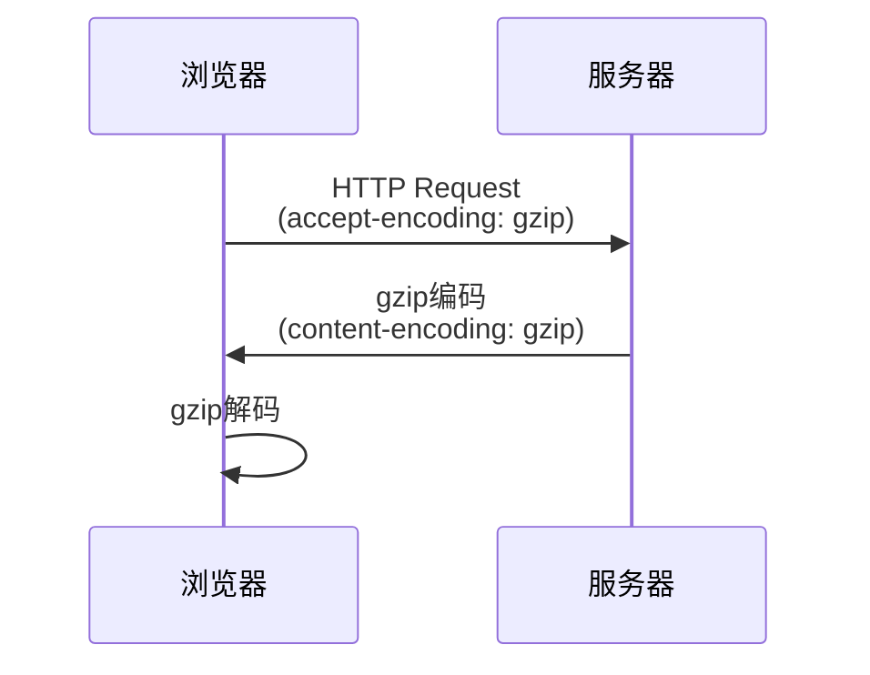
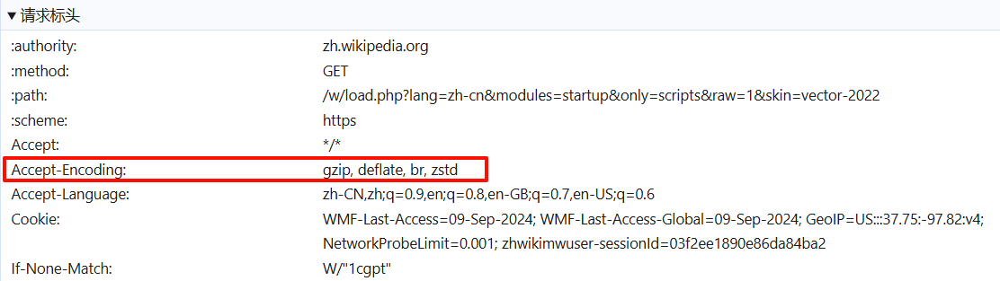
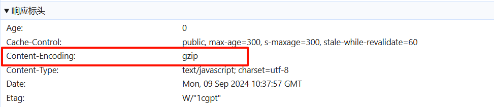

# SPA 首屏加载优化

## 首屏加载是什么

首屏加载（First Contentful Paint，简称 FCP）是衡量网页性能的一个重要指标，它指的是从用户输入网址到浏览器首次在屏幕上渲染任何内容（如文本、图像、背景等）所花费的时间。首屏加载时间包括以下几个阶段：

**请求网页**：用户输入 URL 或点击链接后，浏览器向服务器发送请求。

**服务器处理**：服务器接收到请求后，处理请求并返回 HTML 文档。

**下载资源**：浏览器开始下载 HTML 文档中引用的所有资源，如 CSS、JavaScript、图片等。

**解析和渲染**：浏览器解析 HTML 文档，并开始构建 DOM 树。一旦浏览器解析到足够的内容可以渲染到屏幕上时，就会发生首屏渲染。

## 首屏加载慢的原因

SPA（单页应用）首屏加载速度慢的主要原因可以大致分为以下几点：

**资源体积过大：** SPA 通常需要加载大量资源文件，如果没有经过压缩和优化，会导致加载时间变长。  
**渲染阻塞：** JS 的执行可能会阻塞页面渲染，特别是如果有很多同步脚本或者复杂的初始化代码。  
**网络请求问题：** 页面请求过多、网络延迟或带宽限制会导致资源加载变慢。

## 优化

### 路由懒加载

[官方解释](https://router.vuejs.org/zh/guide/advanced/lazy-loading.html)：当打包构建应用时，`JavaScript` 包会变得非常大，影响页面加载。如果我们能把不同路由对应的组件分割成不同的代码块，然后当路由被访问的时候才加载对应组件，这样就会更加高效。

```js
// 将
// import UserDetails from './views/UserDetails.vue'
// 替换成
const UserDetails = () => import('./views/UserDetails.vue')

const router = createRouter({
  // ...
  routes: [
    { path: '/users/:id', component: UserDetails }
    // 或在路由定义里直接使用它
    { path: '/users/:id', component: () => import('./views/UserDetails.vue') },
  ],
})
```

### 静态资源本地缓存

静态资源文件是基本不会改变的，没必要每次都从服务器中获取。浏览器判断是否想要从服务器中获取资源的依据存在于请求响应头的 `Cache-Control` 字段。

当请求响应头的 `Cache-Control` 可以规定是否可以缓存，缓存方式，缓存的过期时间等。详情可以参考[官网说明](https://developer.mozilla.org/zh-CN/docs/Web/HTTP/Headers/Cache-Control)。

> > 在想要及时更新已经缓存的静态文件时，可以在请求地址上添加版本号参数或者其他信息，当浏览器和服务器发现请求地址不一样时就会重新拉取数据。

#### 设置示例:

```shell
# 禁止缓存
Cache-Control: no-store
# 缓存静态资源
Cache-Control: max-age=3600
Cache-Control: public, max-age=31536000
# 需要重新验证
Cache-Control: no-cache
Cache-Control: max-age=0, must-revalidate
```

#### 设置 Cache-Control 的方法:

**1. 在 html 的头部加入以下标签：**

```html
<meta http-equiv="Cache-Control" content="max-age=7200" />
```

> > 在页面进行设置的优先级是最低的，服务器可以将设置好的响应头进行覆盖。

**2. 在后端服务器中加入：**

这个操作想要看后端使用的什么技术，框架等，但是都会有设置接口响应头的地方。

> > 服务器设置的响应头可以被代理进行覆盖。

**3. 在代理中加入：**

这里以常见的 nginx 代理为例。nginx 代理模型大致如图：



可以看到用户发送请求和服务器响应请求都会通过 nginx 处理。而在 nginx 处理服务器的响应时就可以设置`Cache-Control`，例如：

```nginx
location dist/ {
  root /dist;
  add_header Cache-Control public,max-age=31536000;
}
```

缓存文件请求如图：



请求响应如图（其中 Expires 表示过期时间）：



另外也可以合理使用 [localStorage](https://developer.mozilla.org/zh-CN/docs/Web/API/Window/localStorage) 做本地存储。

### 开启 Tree-shaking

[Tree-shaking](https://www.webpackjs.com/guides/tree-shaking/) 是一个术语，通常用于描述移除 JavaScript 上下文中的死代码。基本原理是利用 ES6 模块的静态特性，通过静态分析来确定哪些模块被导入但实际上未被使用的。在打包时，将这些未被使用的模块视为无用的代码，并将其从最终的打包结果中删除。

在 Webpack5 中，Tree Shaking 在生产环境下默认启动。

```js title='webpack.config.js'
module.exports = {
  // ...
  mode: "production",
};
```

如果想在开发环境启动 Tree Shaking，需要一些配置：

```js title='webpack.config.js'
module.exports = {
  // ...
  mode: 'development',
  optimization: {
    usedExports: true // 启动标记功能（必须）
    minimize: true, // 是否使用自己提供的的插件压缩 bundle。
    minimizer: [] //提供 TerserPlugin 实例，覆盖默认压缩工具(minimizer)。
  }
};
```

在一个纯粹的 ES 模块世界中，很容易识别出哪些文件有副作用。然而，我们的项目无法达到这种纯度，所以，此时有必要提示 webpack 编译器哪些代码是纯粹的。

> 副作用（effect 或者 side effect）指在导入时会执行特殊行为的代码，而不是仅仅暴露一个或多个导出内容。polyfill 就是一个例子，尽管其通常不提供导出，但是会影响全局作用域，因此 polyfill 将被视为一个副作用。

可以通过 package.json 的 `sideEffects` 属性即可实现此目的。

```json title='package.json'
{
  "name": "your-project",
  "sideEffects": false //所有代码都有副作用
}
```

```json title='package.json'
{
  "name": "your-project",
  "sideEffects": false //所有代码都不包含副作用
}
```

```json title='package.json'
{
  "name": "your-project",
  "sideEffects": ["./src/some-side-effectful-file.js", "*.css"] // 指定一些代码存在副作用
}
```

另外在代码文件中可以使用 `/*#__PURE__*/` 注释来将函数调用标记为无副作用，帮助对副作用代码的判断。

```js
/*#__PURE__*/ double(55);
var Button$1 = /*#__PURE__*/ withAppProvider()(Button);
```

### UI 库与框架的按需引入

一般引入第三方库有两种方式：全量引入 和 按需引入。

**全量引入：** 指的是将一个库或框架的所有功能全部引入到项目中，不论实际使用了多少。这种方式简单方便，但会导致最终打包的文件体积较大，增加加载时间。

```js title='main.js'
import Vue from "vue";
import ElementUI from "element-ui"; // 全量引入了 ElementUI 组件库
import "element-ui/lib/theme-chalk/index.css";

Vue.use(ElementUI);
```

**按需引入：** 指的是只引入项目中实际用到的模块或组件，这样可以显著减少打包体积，加快加载速度。

```js title='main.js'
import Vue from "vue";
import { Button, Select } from "element-ui"; // 按需引入 Button 和 Select 组件
import "element-ui/lib/theme-chalk/index.css";

Vue.use(Button);
Vue.use(Select);
```

按需引入通常需要借助工具或插件来实现，例如使用 `babel-plugin-component` 来实现。按需引入的支持，一般由组件库自己提供。

### import() 动态加载

正常使用 import 引入模块位于文件顶层，无论是否真正使用到都会加载。如下：

```js
import data from "./data.js";
import { getDate } from "./tools.js";
```

使用 import() 表达式动态引入数据（在用户登录状态下引入 data 数据）：

```js
if (user.isLogin) {
  import("./data.js").then((module) => {
    // ...
  });
} else {
  // ...
}
```

利用这一特性也可以在框架中动态引入首屏中不关键的组件，加快首屏的渲染。

### 组件重复打包

为减少打包体积，应将频繁引用的公共组件或方法提取至共享模块。这样做可以避免在多个组件中重复定义相同功能，从而避免打包过程中的代码冗余。通过统一引用共享模块，可以确保公共组件或方法仅打包一次，实现代码的高效复用，有效减小最终构建文件的大小。

如果使用 `webpack` 进行打包，那么可以通过配置实现公共模块的提取工作，[详细配置](https://webpack.docschina.org/plugins/split-chunks-plugin/#optimizationsplitchunks)。

```js title='webpack.config.js'
module.exports = {
  //...
  optimization: {
    splitChunks: {
      chunks: "async", // all，async，initial或函数。
      minSize: 20000, // 生成 chunk 的最小体积（以 bytes 为单位）。
      minRemainingSize: 0, // 确保拆分后剩余的最小 chunk 体积超过限制来避免大小为零的模块。
      minChunks: 1, // 拆分前必须共享模块的最小 chunks 数。
      maxAsyncRequests: 30, // 按需加载时的最大并行请求数。
      maxInitialRequests: 30, // 入口点的最大并行请求数。
      enforceSizeThreshold: 50000, // 强制执行拆分的体积阈值和其他限制（minRemainingSize，maxAsyncRequests，maxInitialRequests）将被忽略。
      cacheGroups: {
        defaultVendors: {
          test: /[\\/]node_modules[\\/]/,
          priority: -10,
          reuseExistingChunk: true,
        },
        default: {
          minChunks: 2,
          priority: -20,
          reuseExistingChunk: true,
        },
      },
    },
  },
};
```

### 图片资源的处理

图片资源虽然不在编码过程中，但是它在打包中占用较大的打包体积，也是对页面性能影响最大的因素。减小图片资源对项目体积的影响可以从以下几个方面入手：

#### 改变图片格式

一般常用的图片格式为 `.jpg` 和 `.png`。其中 `.jpg` 图片体积更小，但是不支持透明度并且是有损压缩，`.png` 图片体积大，但是支持透明度并且支持无损压缩。

所以在一些不需要太高质量或者透明度可以用其他方式代替（如图片透明部分改为白色，与页面背景融合，体现为透明效果）时可以考虑将图片转化为 `.jpg` 格式。

#### 压缩图片体积

**手动压缩：** 一般项目中的原始图片是设计稿中的切图或是高清原图等，体积大并且没有通过压缩。拿到这一类图片可以先自行压缩后再放入项目当中。在线压缩图片可以使用 [tinify](https://tinify.cn/)。

**自动压缩：** 除了手动压缩图片，也可以通过第三方插件在打包时自动压缩项目图片（需要在 webpack 中开启并配置一些参数，详情可以查看插件介绍页），常用的压缩图片插件有[image-webpack-loader](https://www.npmjs.com/package/image-webpack-loader)，[image-minimizer-webpack-plugin](https://www.npmjs.com/package/image-minimizer-webpack-plugin)，[imagemin-webpack-plugin](https://www.npmjs.com/package/imagemin-webpack-plugin) 。

#### 使用字体图标库

字体图标是一种使用字体文件来显示图标的技术。与传统的图标图像（如 PNG 或 JPEG 文件）相比，它缩放不失真，可以减少页面请求数量，也易于维护。

常用的字体图标库：[iconfont](https://www.iconfont.cn/)

> > 在线字体库存在风险，最好下载到本地作为静态资源。

#### 雪碧图（CSS Sprites）

雪碧图（CSS Sprites），也称为精灵图，是一种网页图片优化技术。它的核心思想是将网页中多张小图标或背景图片合并到一张大图中，然后通过 CSS 的 background-image、background-position 属性来控制显示大图中的某一部分，以此来减少网页的 HTTP 请求次数，加快页面加载速度。这种方法尤其适用于小图标的显示，因为小图标单独加载时会产生较多的 HTTP 请求。

有很过在线生成雪碧图的网站，例如：[saoban](https://www.saoban.cn/css-sprites.html)，[BEJSON](https://www.bejson.com/ui/css-sprite/)，[toptal](https://www.toptal.com/developers/css/sprite-generator)

#### 转化为 Base64 URL

对于一些小文件图片可以转化为 Base64 来减少请求数量。Webpack 自动转码关键配置如下（或者自行转化并导入）：

```js
module.exports = {
  // ...
  module: {
    rules: [
      // 图片 - 考虑 base64 编码的情况
      {
        test: /\.(png|jpg|jpeg|gif)$/,
        use: {
          loader: "url-loader",
          options: {
            limit: 5 * 1024, // 小于 5kb 的图片用 base64 格式产出
            outputPath: "/img1/",
          },
        },
      },
      // ...
    ],
  },
};
```

> > 使用 Base64 会比直接使用图片的空间大大约 30%，小图片的空间开销对于请求的时长来说是划算的，但是大图片就得不偿失了。

#### 其他优化

**纹理图片：** 对于一些纹理图片，大多作为背景并且样式重复。可以将其分割出最小重复单位，利用 css 中 background 的 repeat 属性重复利用。

**颜色转化：** 项目中可能出现不同颜色的相同图片来表示不同状态，可以考虑使用 css 的 [filter](https://developer.mozilla.org/zh-CN/docs/Web/CSS/filter) 属性完成。

**使用 CSS 作画：** 三角形，加载圆圈，线条组合等一些简单的图片可以考虑使用 css 来完成同样的效果。

**矢量图转化为 SVG 代码：** 矢量图可以考虑转化为 SVG 代码形式导入到项目中。

### gzip 加速

[gzip](https://zh.wikipedia.org/wiki/Gzip) 是一种用于文件压缩与解压缩的文件格式。它基于 Deflate 算法，可将文件压缩地更小，从而实现更快的网络传输。Web 服务器与现代浏览器普遍支持 gzip，这意味着服务器可以在发送文件之前自动使用 gzip 压缩文件，而浏览器可以在接收文件时自行解压缩文件。

#### 工作原理：



1. 浏览器发送请求，并在请求头中自动设置 accept-encoding：gzip，表明浏览器支持 gzip。
2. 在浏览器支持 gzip 并且服务器存在 gzip 内容时服务器发送 gzip 压缩内容，否则发送原内容。
3. 浏览器根据响应头 content-encoding 值来决定是数据处理方式，如果为 gzip 则自动解压。





#### webpack 打包 gzip：

在 webpack 中添加 gzip 相关配置可在打包时自动生成 gzip 压缩包（后缀名为 `.zp`），需要添加 [compression-webpack-plugin](https://www.npmjs.com/package/compression-webpack-plugin) 包。

```js title='webpack.config.js'
const CompressionPlugin = require("compression-webpack-plugin");

module.exports = {
  // ...
  plugins: [
    new CompressionPlugin({
      // filename: "[path][base].gz", // 这种方式是默认的，多个文件压缩就有多个.gz文件，建议使用下方的写法
      filename: "[path].gz[query]", //  使得多个.gz文件合并成一个文件，这种方式压缩后的文件少，建议使用
      test: /\.(js|css|html|svg)$/, // 匹配需要进行Gzip压缩的文件类型
      algorithm: "gzip", // 压缩类型
      threshold: 10240, // 只有文件大小大于等于该值时才会生成Gzip文件
      minRatio: 0.8, // 最小压缩比率
      deleteOriginalAssets: false, //是否删除源文件
    }),
  ],
};
```

#### nginx 支持 gzip：

```nginx title='nginx.conf'
http {
  gzip on;
  # 开启gzip压缩功能。

  gzip_min_length 10k;
  # 设置允许压缩的页面最小字节数; 这里表示如果文件小于10个字节。

  gzip_buffers 4 16k;
  # 设置压缩缓冲区大小，此处设置为4个16K内存作为压缩结果流缓存。

  gzip_http_version 1.1;
  # 设定进行 gzip 压缩的最小 http 版本。

  gzip_comp_level 2;
  # 指定 gzip 压缩的级别，默认为 1，该值可设置的范围是 1-9，数字越大压缩的越好，同时也越占用CPU资源。

  gzip_types text/css text/xml application/javascript;
  # 制定压缩的类型，线上配置时尽可能配置多的压缩类型。

  gzip_disable "MSIE [1-6]\.";
  # 配置禁用gzip条件，支持正则。此处表示ie6及以下不启用gzip（因为ie低版本不支持）。

  gzip_vary on;
  # 是否在响应头中头写入 Vary: Accept-Encoding。

  # ...
}
```

### 使用 SSR

SSR（Server-Side Rendering）是一种在服务器端完成页面渲染的技术。在这种模式下，服务器接收到客户端的请求后，会先根据请求数据和模板文件生成完整的 HTML 页面，然后将这个页面直接发送给客户端。这样，用户可以直接看到完成的内容，无需等待 JavaScript 加载和执行。

#### 优点：

1. 首屏加载速度快：由于服务器已经生成了完整的 HTML 页面，客户端可以直接显示这个页面。
1. SEO 友好：搜索引擎爬虫可以很好地解析由服务器生成的 HTML 页面内容。
1. 适合复杂页面：面对大量数据、需要复杂计算的页面，可以更好地处理并减少客户端的负载。

#### 缺点：

1. 服务器压力大：对于每个请求，服务器都需要重新渲染页面。
1. 开发限制：SSR 要求开发者在编写项目时，需要考虑到服务器端和客户端环境的差异。
1. 调试困难：SSR 的调试过程相对复杂，需要同时考虑到服务器端和客户端的日志和错误信息。

### 其他

还有很多其他优化首屏加载的方法，只要可以减小打包体积、减少请求数量、加快请求速度、提升代码性能的都可以作为优化方向。例如：

1. 优化前端后端代码逻辑。
1. 后端合并部分 http 请求。
1. 接口只返回的真实需要的数据。
1. 优化 sql 代码，减少不必要的查询。
1. 前端的 css 冗余合并。
1. 提升服务器硬件资源。
1. 去除项目不再需要的组件和图片等静态资源。

## 参考

1. [SPA 首屏加载速度慢的怎么解决？](https://vue3js.cn/interview/vue/first_page_time.html)
1. [Vue 路由懒加载](https://router.vuejs.org/zh/guide/advanced/lazy-loading.html)
1. [MDN Cache-Control](https://developer.mozilla.org/zh-CN/docs/Web/HTTP/Headers/Cache-Control)
1. [WebPack Tree-shaking](https://www.webpackjs.com/guides/tree-shaking/)
